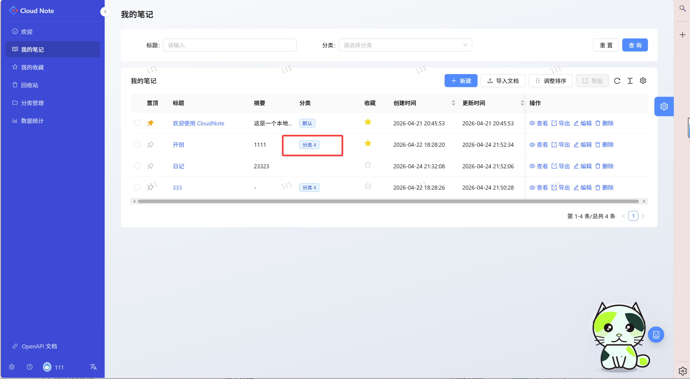

### 介绍
山东大学崇新学堂软件实训代码框架
后端：Springboot 3+ , jdk21, Mybatis, openAPI 3 ,SpringAi 1.1.3
### My teammate: 
### 📚个人笔记本 (B/S)

这是一个基于 Java Spring Boot 开发的现代化在线笔记系统后端服务。项目提供了完善的笔记管理、分类组织、用户鉴权以及 AI 智能辅助功能，为前端（如 React）提供稳定、高效的 RESTful API 接口。

#### 🛡️ 模块一：用户认证与个人数字空间
- 账号体系：提供基础的账号密码注册与登录，确保访问入口安全。
- 数字保险箱机制：登录后系统自动下发 安全 Token。

#### 📒 模块二：核心笔记管理
- 笔记创建: 提供简洁易用的富文本编辑器。用户可以输入标题、编写正文，并在创建时一键选择所属的“知识分类”。支持云端实时保存或手动保存。

  
- 笔记列表与快捷浏览: 直观展示笔记标题、所属分类、创建时间、最后更新时间，以及悬浮的快捷操作按钮（编辑/收藏/删除）。
- 笔记动态更新: 随时进入笔记详情页进行二次编辑、修改标题或转移分类。
  - 智能追踪：系统会自动静默捕获用户的编辑动作，并精准更新该笔记的“最后更新时间”，方便用户追踪知识迭代轨迹。
- 🌟快捷收藏（星标定位）: 在笔记详情或列表页，用户可对高频使用或极具价值的笔记点击“星标”进行收藏。
  - 秒级触达：侧边栏提供独立的“我的收藏”视图，点击即可瞬间过滤出所有星标笔记，在海量数据中实现核心知识的秒级定位。
- 🐚笔记导入与导出: 用户可以自行选择导出为".html" ".md" ".pdf" ".docx"

#### 📁 模块三：分类管理
- 自由抽屉体系：拒绝死板的树状结构，支持自由创建“项目研发”、“生活手记”等个性化分类。
- 动态标签维护：确保每一篇笔记都能被归入最合适的“知识抽屉”，让知识井然有序。
  
#### ♻️ 模块四：数据安全与防误删（回收站机制）
- 功能描述：引入“逻辑删除（Soft Delete）”理念。用户在列表中删除笔记时，笔记不会立刻消失，而是被平滑移入“回收站”专属空间。
- 后悔药机制：在 15 天的保留期内，用户随时可以进入回收站，将误删的笔记“一键恢复”到原分类。
- 定时释放：超过 15 天未恢复的笔记，系统后台会触发定时清理任务，进行永久物理销毁。

#### 📊 模块五：数据统计
- 通过动态饼图或柱状图，直观展示用户在各个分类下的笔记数量占比（例如：“学习类 45篇占 60%，生活类 10篇占 15%”）

#### 🤖 模块六：AI 辅助
- 支持 DeepSeek / 通义千问 / Kimi

- 场景 A：编辑器内嵌 AI 辅助（效率工具）
  - 🪄 AI 智能摘要：长篇大论几秒内提炼成百字核心摘要，自动填充。

  - ✍️ AI 润色纠错：修正错别字、优化语序，在保持原意的基础上调整逻辑结构。

  - 🏷️ 智能分类建议：根据正文语义，AI 自动推荐最契合的标签，告别整理焦虑。

- 场景 B：独立连续对话助手（伴读模式）
  - 💬 沉浸式伴读：侧边栏提供独立聊天面板，具备连续上下文记忆。

- 无缝融合：左侧写代码/记公式，右侧询问：“这段代码为什么报空指针？”或“帮我解释一下傅里叶变换”。获取答案后一键复制回左侧笔记。

  

